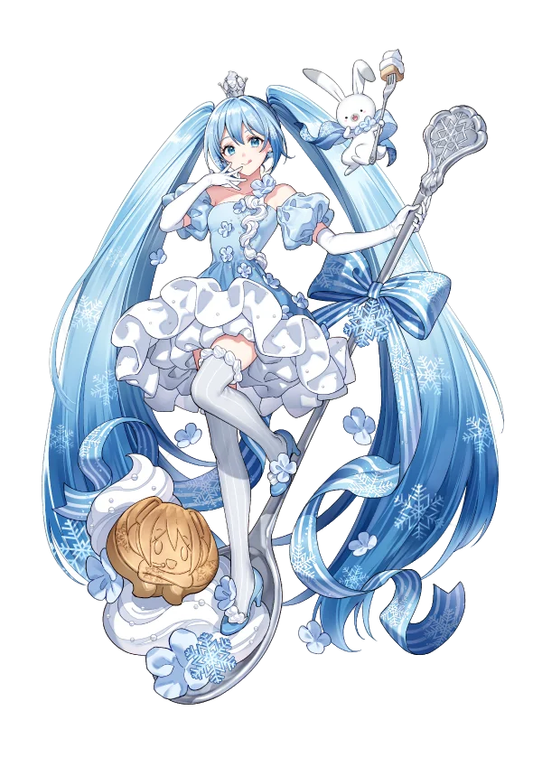
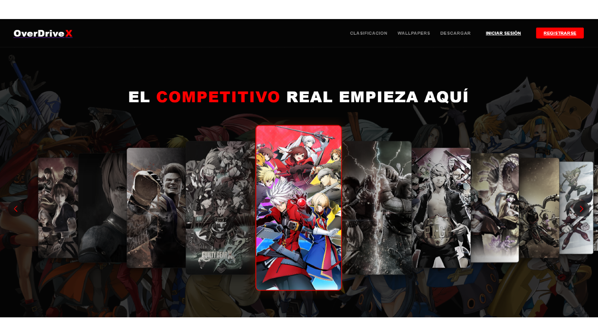

<!--
  ╔══════════════════════════════════════════════════════╗
  ║           dap0ry · GitHub Profile README             ║
  ╚══════════════════════════════════════════════════════╝
-->

&nbsp;&nbsp;

 

<!-- BLOQUE 1: Streak stats -->

 

<!-- BLOQUE 2: Stats + Top langs -->
&nbsp;

 

 

<!-- ACTUALMENTE TRABAJANDO EN -->

<table style="border:none;border-collapse:collapse" border="0" cellspacing="0" cellpadding="8">
<tr>
<td valign="middle" align="center" style="border:none">

</td>
<td valign="middle" align="left" style="border:none">

</td>
<td valign="middle" align="left" style="border:none">

</td>
</tr>
</table>

 

<!-- ICONOS EN UNA SOLA LÍNEA -->

